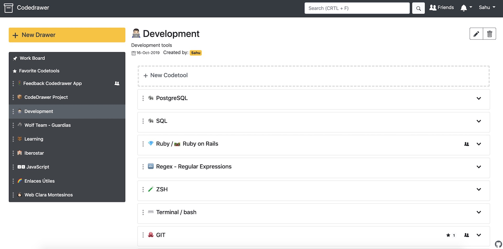

# CodeDrawer

**Codedrawer** helps you to have all your code snippets, daily working annotations and texts (`Codetools`), easily organized by `Drawers`.
+ Generate shared drawers with other users as collaborators.
+ Make public codetools, and share them with an url.
+ Search your friends and make favorites their codetools.
+ Pin your more useful codetools to a Work Board.



## Getting Started

### Prerequisites

```
ruby 2.6
postgresql 11.5
yarn 1.19.0
```

### Installing

```
bundle install
rake db:create
rake db:migrate
yarn install --check-files
rails s
```

To populate example data:
```
rake db:seed
```

## Running the tests
```
rspec
```

## Deployment

```
cap <environment> deploy
```

## Built With

* [Rails 6.0.2](https://edgeguides.rubyonrails.org/6_0_release_notes.html) 
* [Bootstrap 4](https://getbootstrap.com/docs/4.4/getting-started/introduction/)
* [Octicons](https://octicons.github.com/)


## Contributing

Please, contribute with your fork, through a Pull Request.

1. Fork the project
2. Create a topic branch from master.
3. Make some commits to improve the project.
4. Push this branch to your GitHub project.
5. Open a Pull Request on GitHub.

## Authors

* **José Ramón Sahuquillo** - [jrsahuquillo](https://github.com/jrsahuquillo)

## Contributors (Mentoring)
* **Luis Miguel Vázquez** - [luismiv85](https://github.com/luismiv85)
* **Alberto Villar** - [vilvadot](https://github.com/vilvadot)

See also the list of [contributors](https://github.com/jrsahuquillo/CodeDrawerApp/graphs/contributors) who participated in this project.

## License

This project is licensed under the [MIT License](https://www.mit.edu/~amini/LICENSE.md) 